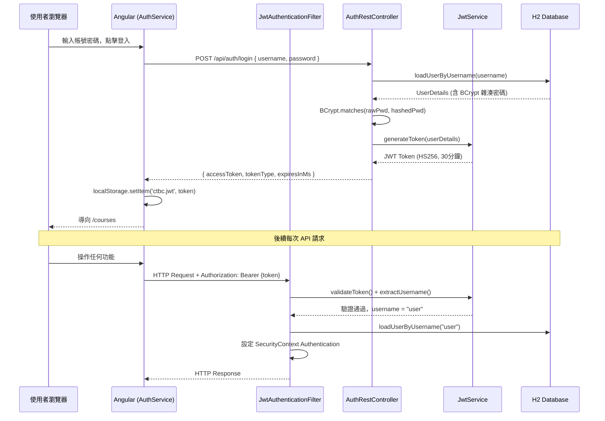

# CTBC 課程管理系統 (Course Management System)

> 一套具備角色權限管控的線上課程瀏覽與管理平台，整合 JWT 身分驗證、RESTful API 與響應式前端介面。

---

## 目錄

1. [專案概述](#1-專案概述-project-overview)
2. [系統架構與模組依賴](#2-系統架構與模組依賴-system-architecture)
3. [核心模組程式邏輯說明](#3-核心模組程式邏輯說明-module-logic--workflow)
4. [關鍵業務流程](#4-關鍵業務流程-key-workflows)
5. [設計模式與亮點](#5-設計模式與亮點-design-patterns--highlights)
6. [快速啟動](#6-快速啟動-quick-start)

---

## 1. 專案概述 (Project Overview)

### 核心功能

| 功能面向 | 說明 |
|---|---|
| **課程目錄** | 公開瀏覽課程清單，支援關鍵字搜尋、分類篩選、講師篩選、排序與分頁 |
| **身分驗證** | JWT 無狀態登入 / 註冊，Token 有效期 30 分鐘 |
| **三級角色管控** | `ADMIN` 管理所有資源、`INSTRUCTOR` 管理自有課程、`USER` 收藏課程 |
| **課程管理** | Admin / Instructor 可 CRUD 課程，並可指定/變更所屬分類 |
| **分類管理** | Admin 可建立、修改、刪除課程分類（有課程時禁止刪除） |
| **收藏功能** | User 可將課程加入/移出個人收藏清單 |

### 技術棧

| 層級 | 技術 | 版本 |
|---|---|---|
| **後端框架** | Spring Boot | 3.2.0 |
| **語言** | Java | 21 |
| **安全框架** | Spring Security + JJWT | 6.x / 0.11.5 |
| **資料庫** | H2 (in-memory) + Spring Data JPA | - |
| **前端框架** | Angular | 16.2.0 |
| **前端語言** | TypeScript | 5.1.3 |
| **UI 樣式** | Bootstrap | 5.3.8 |
| **非同步處理** | RxJS | 7.8.0 |
| **建置工具** | Maven (後端) / Angular CLI (前端) | - |

---

## 2. 系統架構與模組依賴 (System Architecture)

### 整體架構設計

本專案採用**前後端分離**架構，後端遵循經典 **MVC 三層架構**（Controller → Service → Repository），前端採用 Angular 的**模組化元件架構**。前後端透過 HTTP Proxy 橋接，JWT Token 作為跨層狀態傳遞的唯一憑證。

```
瀏覽器 (Angular SPA :4200)
        │  HTTP + JWT Bearer Token
        ▼  (proxy /api → :8080)
Spring Boot REST API (:8080)
        │
   ┌────▼────┐
   │Controller│  ← 路由分派、DTO 轉換、權限標註
   └────┬────┘
        │
   ┌────▼────┐
   │ Service  │  ← 業務規則、角色驗證、交易管理
   └────┬────┘
        │
   ┌────▼──────────┐
   │  Repository   │  ← JPA + Criteria API 動態查詢
   └────┬──────────┘
        │
   ┌────▼────┐
   │  H2 DB  │  ← in-memory (隨應用程式啟動自動建表)
   └─────────┘
```

### 核心目錄結構

#### 後端 (`internlab002/`)

```
src/main/java/com/ctbc/assignment2/
├── Assignment2Application.java          # Spring Boot 啟動入口
│
├── bean/                                # JPA 實體 (資料庫映射)
│   ├── AppUser.java                     # 使用者實體 (username, password, role)
│   ├── CourseBean.java                  # 課程實體 (name, price, imageUrl, instructor)
│   ├── CourseCategoryBean.java          # 課程分類實體 (一對多 → CourseBean)
│   └── CourseFavorite.java              # 收藏關係實體 (user_id + course_id 聯合唯一)
│
├── controller/rest/                     # REST 控制器層
│   ├── AuthRestController.java          # 登入 / 註冊
│   ├── CourseBeanRestController.java    # 課程 CRUD + 分頁搜尋
│   ├── CategoryBeanRestController.java  # 分類 CRUD
│   ├── CourseFavoriteController.java    # 收藏功能
│   ├── UserRestController.java          # 使用者查詢 (依角色)
│   └── dto/                             # 資料傳輸物件 (AuthRequest/Response, RegisterRequest)
│
├── service/                             # 服務介面層
│   ├── impl/                            # 服務實作 (JPA 版本)
│   │   ├── CourseBeanServiceJPAImplement.java       # 課程核心業務邏輯
│   │   └── CourseCategoryBeanServiceJPAImplement.java
│   ├── AppUserService.java
│   ├── CourseBeanService.java
│   ├── CourseCategoryBeanService.java
│   └── CourseFavoriteService.java
│
├── repository/                          # 資料存取層 (Spring Data JPA)
│   ├── AppUserRepository.java
│   ├── CourseBeanRepository.java        # 擴充 JpaSpecificationExecutor (動態查詢)
│   ├── CourseCategoryBeanRepository.java
│   └── CourseFavoriteRepository.java
│
├── security/                            # Spring Security + JWT
│   ├── SecurityConfig.java              # 安全設定、CORS、路由規則
│   ├── JwtService.java                  # Token 產生 / 驗證 / 解析
│   └── JwtAuthenticationFilter.java     # 每次請求的 JWT 驗證過濾器
│
├── config/                              # 設定 Bean
│   ├── AppUserSeeder.java               # 啟動時建立預設帳號
│   ├── PasswordEncoderConfig.java       # BCrypt Bean
│   └── WebConfig.java                   # CORS 全域設定
│
├── exception/                           # 自訂例外 + 全域處理器
│   ├── GlobalExceptionHandler.java      # @RestControllerAdvice 統一錯誤回應
│   └── [各種自訂 Exception...]
│
└── utils/
    └── DefaultImageUtil.java            # 產生預設課程圖片 URL (Picsum)
```

#### 前端 (`ctbc-course-system/src/app/`)

```
app/
├── app.module.ts                        # 根模組，宣告所有元件與 Provider
├── app-routing.module.ts                # 路由定義 (含 AuthGuard 保護)
├── app.component.ts/html                # 全域導覽列 (角色自適應選單)
│
├── auth/                                # 身分驗證模組
│   ├── auth.service.ts                  # JWT 存取、角色解析、登入/登出
│   ├── auth.guard.ts                    # 路由守衛 (CanActivate)
│   ├── auth.interceptor.ts              # HTTP 攔截器 (自動附加 Bearer Token)
│   ├── auth.models.ts                   # DTO 介面定義
│   ├── login/                           # 登入頁元件
│   └── register/                        # 註冊頁元件
│
├── models/                              # 前端資料模型
│   ├── course.ts                        # Course 介面 (含 isEditing UI 旗標)
│   ├── category.ts                      # Category 介面
│   └── page.ts                          # 泛型分頁模型 Page<T>
│
├── services/                            # HTTP 服務層
│   ├── course.service.ts                # 課程 API 呼叫 (含分頁參數)
│   └── category.service.ts             # 分類 API 呼叫
│
├── category-catalog/                    # 公開分類瀏覽頁
├── course-catalog/                      # 公開課程列表頁 (搜尋/篩選/分頁)
├── category/                            # Admin 分類管理頁
├── course/                              # Admin/Instructor 課程管理頁
└── favorite/                            # User 收藏清單頁
    └── favorite.service.ts              # 收藏 API 呼叫
```

### 模組依賴關係

```
[Controller]
  ├─ 注入 → [Service Interface]
  │           └─ 實作 → [ServiceImpl]
  │                       ├─ 注入 → [Repository] → H2 DB
  │                       ├─ 注入 → [AppUserService] (角色查詢)
  │                       └─ 呼叫 → [DefaultImageUtil]
  │
  └─ 注入 → [JwtService] (AuthController 用於產 Token)

[SecurityConfig]
  └─ 注入 → [JwtAuthenticationFilter]
              └─ 注入 → [JwtService] + [AppUserService.loadUserByUsername()]

[Angular Components]
  └─ 注入 → [Service] → HttpClient (with AuthInterceptor) → REST API
```

---

## 3. 核心模組程式邏輯說明 (Module Logic & Workflow)

### 3.1 安全模組 (`security/`)

#### `JwtService` — Token 生命週期管理

```java
// Token 產生：將 username 與 roles 編碼進 Claims
public String generateToken(UserDetails userDetails) {
    Map<String, Object> claims = new HashMap<>();
    claims.put("roles", userDetails.getAuthorities()...);
    return Jwts.builder()
        .setClaims(claims)
        .setSubject(userDetails.getUsername())
        .setIssuedAt(new Date())
        .setExpiration(new Date(System.currentTimeMillis() + jwtExpirationMs))
        .signWith(getSignKey(), SignatureAlgorithm.HS256)
        .compact();
}
```

| 方法 | 職責 |
|---|---|
| `generateToken()` | 以 HS256 簽署產生含 roles Claims 的 JWT |
| `validateToken()` | 驗證 Token 簽名並確認未過期 |
| `extractUsername()` | 從 Token Payload 解出 subject (username) |
| `extractRoles()` | 解析 roles claim，供 SecurityContext 使用 |
| `getSignKey()` | 支援 Base64 與純文字 secret，統一轉為 SecretKey |

#### `JwtAuthenticationFilter` — 請求攔截管線

每次 HTTP 請求進入時執行以下流程：

```
1. 讀取 Authorization Header → 截取 "Bearer " 後的 token
2. JwtService.extractUsername() 取出使用者名稱
3. SecurityContext 尚未有認證 → 呼叫 loadUserByUsername()
4. JwtService.validateToken() 驗證簽名與到期
5. 建立 UsernamePasswordAuthenticationToken 並注入 SecurityContext
6. 繼續執行 Filter Chain
```

#### `SecurityConfig` — 路由安全規則

```java
// 公開路由：允許所有人存取
.requestMatchers("/api/auth/**").permitAll()
.requestMatchers(HttpMethod.GET, "/api/category/**", "/api/course/**").permitAll()

// 其餘路由：需通過 JWT 驗證
.anyRequest().authenticated()
```

- **CORS**：允許 `http://localhost:4200`，支援 GET/POST/PUT/DELETE/OPTIONS
- **Session**：`STATELESS`（純 JWT，無 Session Cookie）
- **方法級安全**：啟用 `@EnableMethodSecurity`，支援 `@PreAuthorize`

---

### 3.2 課程業務邏輯層 (`service/impl/CourseBeanServiceJPAImplement`)

這是整個系統中**最複雜的業務邏輯類別**，負責依呼叫者角色執行不同的權限邏輯。

#### 角色導向的查詢邏輯 (`findPage`)

```java
public Page<CourseBean> findPage(int page, int size, String keyword,
                                  Long categoryId, String sort, String instructor,
                                  Authentication auth) {
    // 1. 從 Authentication 物件判斷呼叫者角色
    boolean isAdmin = auth.getAuthorities().contains("ROLE_ADMIN");
    boolean isInstructor = auth.getAuthorities().contains("ROLE_INSTRUCTOR");

    // 2. Instructor 只能看自己的課程
    if (isInstructor && !isAdmin) {
        instructor = auth.getName(); // 強制覆蓋為自己
    }

    // 3. 使用 Criteria API 動態組合查詢條件
    Specification<CourseBean> spec = buildSpec(keyword, categoryId, instructor);

    // 4. 回傳分頁結果
    return repository.findAll(spec, pageable);
}
```

#### 課程建立時的業務驗證 (`save`)

```java
// 重複課程名稱驗證
if (repository.existsByCourseName(course.getCourseName())) {
    throw new DuplicateCourseNameException("課程名稱已存在");
}

// Instructor 只能為自己建立課程
if (isInstructor) {
    course.setInstructor(currentUser); // 強制設定為本人
}

// 無圖片時自動產生預設圖
if (course.getImageUrl() == null || course.getImageUrl().isBlank()) {
    course.setImageUrl(DefaultImageUtil.getDefaultImageUrl(savedCourse.getId()));
}
```

#### 動態查詢 (Criteria API)

`CourseBeanRepository` 同時擴充 `JpaSpecificationExecutor<CourseBean>`，允許在執行期動態組合 WHERE 子句：

```java
// 動態組合：keyword (LIKE) + categoryId (= ) + instructor (= )
Specification<CourseBean> spec = (root, query, cb) -> {
    List<Predicate> predicates = new ArrayList<>();
    if (keyword != null) predicates.add(cb.like(root.get("courseName"), "%" + keyword + "%"));
    if (categoryId != null) predicates.add(cb.equal(root.get("category").get("id"), categoryId));
    if (instructor != null) predicates.add(cb.equal(root.get("instructor").get("username"), instructor));
    return cb.and(predicates.toArray(new Predicate[0]));
};
```

---

### 3.3 例外處理模組 (`exception/GlobalExceptionHandler`)

以 `@RestControllerAdvice` 統一攔截所有 Controller 拋出的例外，轉換為標準化 JSON 錯誤回應。

```java
// 標準錯誤回應格式
{
  "timestamp": "2025-01-01T10:00:00",
  "message": "課程名稱已存在",
  "details": "uri=/api/course"
}
```

| 例外類型 | HTTP 狀態碼 | 觸發情境 |
|---|---|---|
| `ResourceNotFoundException` | 404 | 查詢不存在的 Course/Category |
| `DuplicateCourseNameException` | 409 | 新增/修改課程名稱重複 |
| `CategoryNotEmptyException` | 409 | 刪除含課程的分類 |
| `ForbiddenException` | 403 | Instructor 操作他人課程 |
| `InvalidFileException` | 400 | 上傳非法檔案格式 |
| `MethodArgumentNotValidException` | 400 | Bean Validation 失敗 |
| `Exception` (catch-all) | 500 | 未預期的系統錯誤 |

---

### 3.4 Angular 身分驗證模組 (`auth/`)

#### `AuthService` — 前端 Token 管理中樞

```typescript
// Token 存放於 localStorage
private readonly TOKEN_KEY = 'ctbc.jwt';

// 角色解析：Base64 解碼 JWT Payload
getRole(): string | null {
  const token = this.getToken();
  if (!token) return null;
  const payload = JSON.parse(atob(token.split('.')[1]));
  return payload.roles?.[0] ?? null;
}

// Token 到期檢查
isTokenExpired(): boolean {
  const payload = JSON.parse(atob(token.split('.')[1]));
  return (payload.exp * 1000) < Date.now();
}
```

| 方法 | 職責 |
|---|---|
| `login()` | POST `/api/auth/login`，存儲回傳的 accessToken |
| `register()` | POST `/api/auth/register` |
| `getRole()` | 解析 JWT Payload 取得角色 |
| `isAdmin/isInstructor/isUser()` | 快速角色判斷 |
| `isLoggedIn()` | 非空 Token 且未過期 |
| `logout()` | 清除 localStorage Token |

#### `AuthInterceptor` — 自動附加 Token

```typescript
intercept(req: HttpRequest<any>, next: HttpHandler): Observable<HttpEvent<any>> {
  const token = this.authService.getToken();
  if (token && !req.url.includes('/api/auth/')) {
    req = req.clone({
      setHeaders: { Authorization: `Bearer ${token}` }
    });
  }
  return next.handle(req).pipe(
    catchError(err => {
      if (err.status === 401) {
        this.authService.logout();
        this.router.navigate(['/login']);
      }
      return throwError(() => err);
    })
  );
}
```

#### `AuthGuard` — 路由守衛

```typescript
canActivate(): boolean {
  if (this.authService.isLoggedIn()) return true;
  this.router.navigate(['/login']);
  return false;
}
```

---

### 3.5 Angular 課程目錄元件 (`course-catalog/`)

這是前端**最複雜的元件**，整合了 RxJS 響應式搜尋、URL 狀態同步與分頁管理。

```typescript
// 響應式搜尋：以 Subject 驅動，避免重複 API 請求
private searchSubject = new Subject<string>();

ngOnInit() {
  this.searchSubject.pipe(
    debounceTime(300),              // 等待使用者停止輸入 300ms
    distinctUntilChanged(),          // 相同關鍵字不重送
    switchMap(keyword => {           // 取消前次未完成的請求
      return this.courseService.getPage(
        this.currentPage, this.pageSize, keyword,
        this.selectedCategoryId, this.sortOption, this.selectedInstructor
      );
    })
  ).subscribe(page => this.updatePageState(page));
}
```

**URL Query Params 狀態持久化**：搜尋條件變更時同步更新瀏覽器 URL，支援分享連結與瀏覽器前後頁導航。

---

## 4. 關鍵業務流程 (Key Workflows)

### 流程一：使用者登入與 JWT 驗證



---

### 流程二：Instructor 分頁搜尋與建立課程

```
【搜尋課程（角色導向查詢）】

1. Angular CourseComponent
   └─ 呼叫 CourseService.getPage(page, size, keyword, categoryId, sort, instructor)
   
2. HTTP GET /api/course?page=0&size=10&keyword=Java
   └─ Authorization: Bearer {JWT Token}
   
3. JwtAuthenticationFilter
   └─ 驗證 Token → 設定 Authentication (ROLE_INSTRUCTOR)
   
4. CourseBeanRestController.findPage()
   └─ 注入 Authentication 物件
   └─ 呼叫 CourseBeanService.findPage(..., authentication)
   
5. CourseBeanServiceJPAImplement.findPage()
   └─ 判斷角色為 INSTRUCTOR
   └─ 強制將 instructor 參數設為目前登入者 username
   └─ 使用 Criteria API 建構 Specification
   └─ repository.findAll(spec, pageable) → H2 DB
   
6. 回傳 Page<CourseBean> → JSON → Angular
   └─ Angular 渲染課程列表（僅顯示自己的課程）


【建立新課程】

1. Angular CourseComponent
   └─ 使用者填寫表單 → 呼叫 CourseService.save(course)
   
2. HTTP POST /api/course { courseName, price, summary, ... }
   
3. CourseBeanRestController.create()
   └─ @PreAuthorize("hasAnyRole('ADMIN', 'INSTRUCTOR')")
   └─ 呼叫 CourseBeanService.save(course, authentication)
   
4. CourseBeanServiceJPAImplement.save()
   ├─ 驗證：repository.existsByCourseName() → 若重複拋出 DuplicateCourseNameException
   ├─ 若 INSTRUCTOR：強制 course.setInstructor(currentUser)
   ├─ repository.save(course) → 取得 ID
   └─ 若無圖片：course.setImageUrl(DefaultImageUtil.getDefaultImageUrl(id))
      └─ 產生 "https://picsum.photos/seed/course-{id}/400/250"
   
5. 回傳 201 Created + CourseBean JSON → Angular 更新列表
```

---

## 5. 設計模式與亮點 (Design Patterns & Highlights)

### 5.1 策略模式 (Strategy Pattern) — 角色導向業務規則

**位置：** `CourseBeanServiceJPAImplement.java`

在同一個 `findPage()`、`save()`、`deleteById()` 方法內，依 `Authentication` 物件中的角色動態選擇執行策略，而非寫多個 Controller 方法：

```java
// 相同方法入口，不同角色走不同邏輯分支
if (isAdmin) {
    // 可存取所有課程
} else if (isInstructor) {
    instructor = auth.getName(); // 限縮為自己的課程
} else {
    throw new ForbiddenException("無操作權限");
}
```

**解決的問題：** 避免 Controller 層充斥角色判斷邏輯，將權限規則內聚到 Service 層。

---

### 5.2 過濾器鏈模式 (Chain of Responsibility) — JWT Filter

**位置：** `JwtAuthenticationFilter extends OncePerRequestFilter`

Spring Security 的 Filter Chain 即是責任鏈模式的實現。`JwtAuthenticationFilter` 插入 `UsernamePasswordAuthenticationFilter` 之前，處理 Bearer Token 後繼續向下傳遞：

```java
// 處理完畢後，無論成功失敗都繼續傳遞給下個 Filter
filterChain.doFilter(request, response);
```

---

### 5.3 規格模式 (Specification Pattern) — 動態查詢

**位置：** `CourseBeanRepository extends JpaSpecificationExecutor` + `CourseBeanServiceJPAImplement`

以 Criteria API 動態組合查詢條件，避免為每種搜尋組合撰寫獨立的 Repository 方法：

```java
// 執行期動態決定 WHERE 子句，而非靜態 JPQL
Specification<CourseBean> spec = (root, query, cb) -> {
    List<Predicate> predicates = new ArrayList<>();
    if (keyword != null) predicates.add(cb.like(...));
    if (categoryId != null) predicates.add(cb.equal(...));
    return cb.and(predicates.toArray(new Predicate[0]));
};
repository.findAll(spec, pageable);
```

---

### 5.4 攔截器模式 (Interceptor Pattern) — 自動附加 Token

**位置：** `auth.interceptor.ts (Angular HttpInterceptor)`

全域攔截所有 HTTP 請求，自動注入 Bearer Token，讓所有 Service 無需手動處理 Authorization Header：

```typescript
// 每個 HttpClient 請求都會通過此攔截器
req = req.clone({ setHeaders: { Authorization: `Bearer ${token}` } });
```

---

### 5.5 種子資料模式 (Data Seeder) — CommandLineRunner

**位置：** `AppUserSeeder implements CommandLineRunner`

應用程式啟動後自動建立預設帳號，確保開發環境隨時可用：

| 帳號 | 密碼 | 角色 |
|---|---|---|
| `admin` | `admin123` | ADMIN |
| `user` | `user123` | USER |
| `instructor1~3` | `inst123` | INSTRUCTOR |

---

### 5.6 亮點：RxJS 響應式搜尋管線

**位置：** `course-catalog.component.ts`

使用 RxJS 操作符組合形成高效的搜尋體驗：

```typescript
searchSubject.pipe(
  debounceTime(300),       // 避免每次按鍵都送出請求
  distinctUntilChanged(),   // 相同內容不重複請求
  switchMap(...)            // 自動取消舊請求，只保留最新
)
```

這個設計**防止了 Race Condition**（後發先至的 HTTP 回應覆蓋最新結果），是前端效能最佳化的典型實踐。

---

## 6. 快速啟動 (Quick Start)

### 環境需求

- Java 21+
- Node.js 18+ / npm 9+
- Maven 3.8+

### 啟動後端

```bash
cd internlab002
mvn spring-boot:run
# API 服務啟動於 http://localhost:8080
# H2 Console：http://localhost:8080/h2-console (JDBC URL: jdbc:h2:mem:lab02)
```

### 啟動前端

```bash
cd ctbc-course-system
npm install
npm start
# 前端啟動於 http://localhost:4200
# /api 請求自動 proxy 至 http://localhost:8080
```

### 預設帳號

| 帳號 | 密碼 | 可用功能 |
|---|---|---|
| `admin` | `admin123` | 所有功能 (課程 + 分類管理) |
| `instructor1` | `inst123` | 管理自己的課程 |
| `user` | `user123` | 瀏覽課程、加入收藏 |
